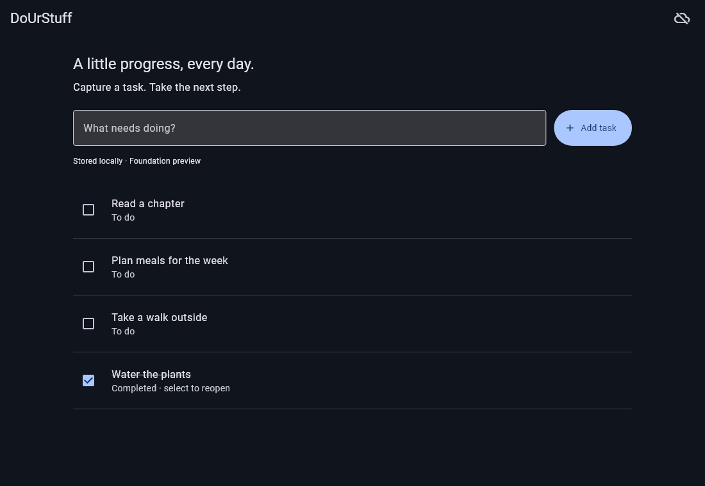

# DoUrStuff

An offline-first personal task manager for everyday progress, built with Flutter
and SQLite. Start without an account; cloud sync will be optional.

**Current delivery: phase 1 foundation preview.** Capture tasks, complete and
reopen them, and retain them in a local database. Dark UI adapts to narrow touch
screens and desktop windows. Ctrl+N focuses capture. The current app makes no
network requests and requires no account.

Full task editing, tags, milestones, priorities, views, calendar, recurrence,
reminders, export/import and Supabase sync are planned in phases 2–5.
Their schemas/contracts do not mean those features are implemented.

| Platform | Status |
| --- | --- |
| Android arm64 | Native project; build/device evidence in the phase report |
| Windows x64 | Native project; local build blocked by missing C++ workload |
| iOS, macOS, Linux | Planned; native projects and runtime support unverified |

Actual Flutter widget render with synthetic local data (not a native-device screenshot):



[Narrow-screen preview](docs/screenshots/foundation-390.png). Regenerate with
`flutter test tool/render_preview.dart`; set FLUTTER_ROOT to the SDK if needed.

## Quick start

Install Flutter **3.47.6** / Dart 3.13.5 and native prerequisites in
[setup](docs/runbooks/setup.md). From this repository:

```sh
flutter pub get --enforce-lockfile
flutter run -d windows
# Or select a connected Android device:
flutter devices
flutter run -d DEVICE_ID
```

No backend or configuration file is required. config/sync.example.json describes
future public settings; phase 1 does not consume it.

```sh
dart run build_runner build
dart format --output=none --set-exit-if-changed lib test tool
flutter analyze
flutter test
```

Data lives in the platform application-support directory under
profiles/guest/tasks.sqlite. Do not copy only this file while the app is running:
committed data can still be in its WAL. See [recovery](docs/runbooks/recovery.md).
Android OS app-data backup is disabled to avoid restoring transport identity
without a recovery policy. Portable in-app export is phase 5 work.

## Project guide

- [Architecture](docs/architecture/README.md) and [accepted plan](docs/proposals/2026-10-03-offline-first-architecture.md)
- [Decision records](docs/adr/README.md)
- [Verification](docs/verification/phase-1.md) and [backlog](docs/backlog.md)
- [Fresh-session prompts for later phases](docs/prompts/README.md)
- [Two-device tests](docs/runbooks/two-device-testing.md)
- [Builds/releases](docs/runbooks/releases.md)
- [Optional backend](docs/runbooks/backend.md) and [costs](docs/runbooks/costs.md)
- [Repository conventions](AGENTS.md)

No cloud deployment, signed installer, store publication or notification support
exists yet. CI definitions are supplied; hosted execution remains unverified.
Platform support requires installed-device evidence, not only passing widget tests.
