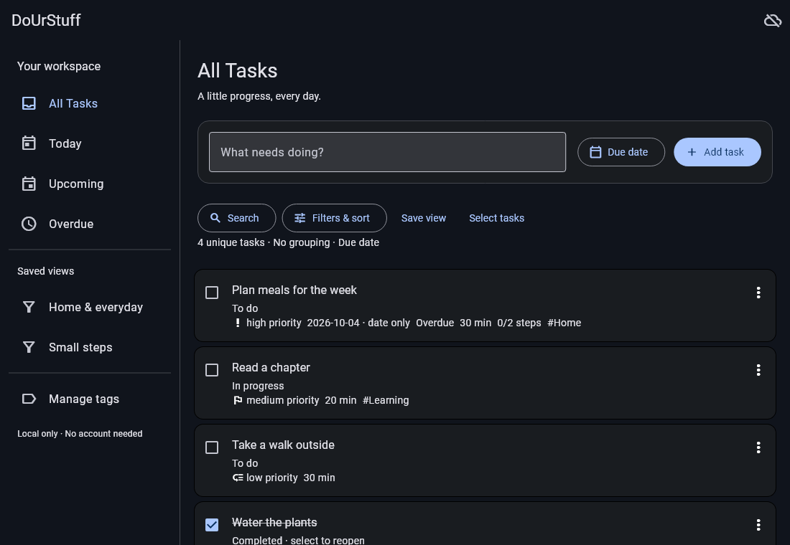

# DoUrStuff

An offline-first personal task manager for everyday progress, built with Flutter
and SQLite. Start without an account; cloud sync will be optional.

**Current delivery: Phase 2 offline task application.** Capture, edit, complete,
reopen, cancel and delete tasks with local undo. Add descriptions, labelled
priorities, date-only or timed deadlines, effort estimates, reusable tags and
ordered independent milestones. Search, filter, group and sort tasks; use
Today/Upcoming/Overdue/All or named saved views with a persistent startup default.
No account or network is required.

Dark layouts adapt to narrow touch screens and desktop windows. Ctrl+N focuses
capture, Ctrl+F opens filters, and Ctrl+S saves task details. Failed saves keep
the draft. See the [offline guide](docs/architecture/phase-2-offline.md) for query,
date/time, saved-view and undo behavior.

Accounts/sync remain Phase 3; recurrence, calendar and reminders remain Phase 4;
portable export/import and release hardening remain Phase 5. Reserved schemas
and notification-dirty rows are not working integrations.

| Platform | Status |
| --- | --- |
| Android arm64 | Native compilation evidence and installed-device gaps in the Phase 2 report |
| Windows x64 | Local release build and unpackaged launch verified; user confirmed offline editing and restart persistence on 9 October. Packaged-install checks remain open |
| iOS, macOS, Linux | Planned; native projects and runtime support unverified |

Actual Flutter widget render with synthetic SQLite data (not an installed-device screenshot):



[Narrow-screen preview](docs/screenshots/phase-2-390.png) and
[task editor](docs/screenshots/phase-2-800.png). Regenerate with
`flutter test tool/render_preview.dart`; set FLUTTER_ROOT to the SDK if needed.

## Quick start

Install Flutter **3.47.6** / Dart 3.13.5 and native prerequisites in
[setup](docs/runbooks/setup.md). From this repository:

```sh
flutter pub get --enforce-lockfile
flutter run -d windows
# Or select a connected Android device:
flutter devices
flutter run -d DEVICE_ID
```

No backend or configuration file is required. config/sync.example.json describes
future public settings; the offline app does not consume it.

```sh
dart run build_runner build
dart format --output=none --set-exit-if-changed lib test tool
flutter analyze
flutter test
```

Data lives in the platform application-support directory under
profiles/guest/tasks.sqlite. Do not copy only this file while the app is running:
committed data can still be in its WAL. See [recovery](docs/runbooks/recovery.md).
Android OS app-data backup is disabled to avoid restoring transport identity
without a recovery policy. Portable in-app export is phase 5 work.

## Project guide

- [Architecture](docs/architecture/README.md) and [accepted plan](docs/proposals/2026-10-03-offline-first-architecture.md)
- [Decision records](docs/adr/README.md)
- [Phase 2 verification](docs/verification/phase-2.md) and [backlog](docs/backlog.md)
- [Phase 3 delivery plan](docs/proposals/2026-10-09-phase-3-plan.md) (planning only)
- [Fresh-session prompts for later phases](docs/prompts/README.md)
- [Two-device tests](docs/runbooks/two-device-testing.md)
- [Builds/releases](docs/runbooks/releases.md)
- [Optional backend](docs/runbooks/backend.md) and [costs](docs/runbooks/costs.md)
- [Repository conventions](AGENTS.md)

No cloud deployment, signed installer, store publication or notification support
exists yet. Phase 1 hosted quality and native builds passed. Phase 2 local checks
are recorded in the verification report; see [GitHub Actions](https://github.com/ipar569/DoUrStuff/actions)
for current hosted run results.
Platform support requires installed-device evidence, not only passing widget tests.
