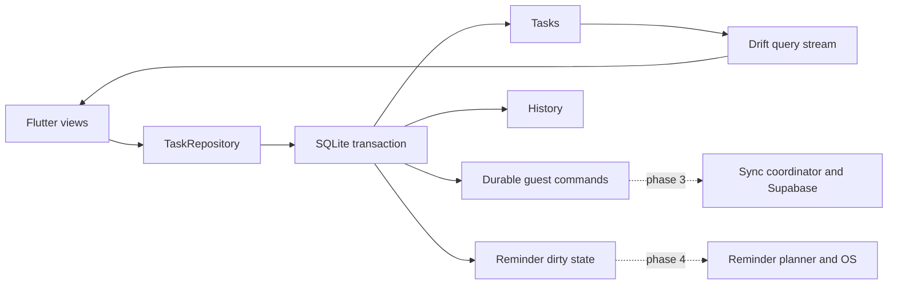

# Architecture and implementation boundary

The user accepted the seven decisions on 3 October 2026. The
[accepted specification](../proposals/2026-10-03-offline-first-architecture.md)
is the normative design, including source research and tradeoffs. Its original
audit is historical; current evidence belongs in the phase report.

Current commands capture, complete and reopen tasks. Each transaction writes
entity state, history, an immutable command envelope with contiguous sequence,
and reminder-dirty generation together. Repeated completion is a no-op; reopening
preserves history. UI reads committed streams and keeps failed drafts. No network
or OS scheduling call occurs inside a database transaction.

Domain ports have no Flutter/provider imports. TaskRepository has a real SQLite
implementation. Auth storage, transport and notification ports are contracts,
not mocked integrations exposed as working features. Riverpod is deferred until
phase 2 shared controller state warrants it.

## Concrete local schema

The authoritative SQL is [schema.drift](../../lib/data/local/schema.drift), with
[schema v1 snapshot](../../drift_schemas/drift_schema_v1.json). Tasks use stable
UUIDs, UTC epoch milliseconds for instants and YYYY-MM-DD for civil dates.
SQL enforces required titles, status/completion consistency, mutually exclusive
due representations, priorities, positive estimates and foreign keys.

Active tables: tasks, profile_metadata, outbox, history, notification_dirty,
sync_checkpoint. Preference storage is tested directly, without an editor yet.
Reserved tables: tags, task_tags, milestones, recurrence_series,
recurrence_segments, occurrence_state, reminder_rules, snoozes, saved_views,
shared_preferences, device_preferences, sync_shadow, conflicts, tombstones,
device_notifications and import_journal.

Reserved tables do not yet have application commands or all semantic validators.
Valid civil dates/IANA zones, versioned JSON recurrence/view rules, the five-rule
reminder limit and occurrence relationships must be enforced before enabling
those features. Presence in the schema is not a completed feature.

Each profile uses its own SQLite file with immutable profile ID, lineage and
device epoch. Opening a file under the wrong profile fails. Use foreign keys,
WAL, synchronous FULL and short transactions. Version 1 creates fresh databases;
later versions need explicit upgrade steps and retained fixtures. Native setup
backs up older schemas with VACUUM INTO before entering migration transactions.
Unsupported upgrades/newer schemas fail without deleting the database.

## Integration contracts

| Contract | Accepted specification section |
| --- | --- |
| Components, schema and durability | 4–5 |
| Dates, recurrence, DST and history | 6 |
| Search, views, calendar and stable ordering | 7 |
| RPCs, cursor, conflicts, retries, bootstrap and retention | 8 |
| Account isolation, explicit adoption and deletion | 9 |
| Reminder/snooze/device semantics | 10 |
| Backup/import and recovery | 11 |
| CI and phased acceptance | 12–13 |

Protocol v1 encodes operation UUID, device epoch, contiguous sequence, entity,
command, changes, base field versions and dependencies. The committed golden
fixture verifies encoding only. Guest commands stay local. Adoption will create
authorized account operations through a resumable manifest; it must not upload
the guest journal blindly. Account commands currently fail closed because
shadow-aware base versions do not exist yet.

The future server must lock account_state before advancing its transactional
cursor and committing changes/log/receipts. Device clocks never order conflicts.
Field revisions merge unrelated edits and retain competing candidates. Tombstone
IDs and device high-water marks survive log expiry. Real PostgreSQL/RLS tests
are required before these guarantees can be claimed.

Occurrence identity uses UUIDv5 namespace
`45c4f10e-70ac-5b0a-9b5b-17118e51c436` and compact JSON tuple
`[lowercaseSeriesUuid,lowercaseSegmentUuid,ordinal]`, starting at ordinal zero.
An independent Python UUID fixture locks this contract; generation and timezone
resolution remain phase 4 work.

Profile switching, secure tokens, adoption, bootstrap, auth recovery and account
deletion will ship together with their safety paths in phase 3.
