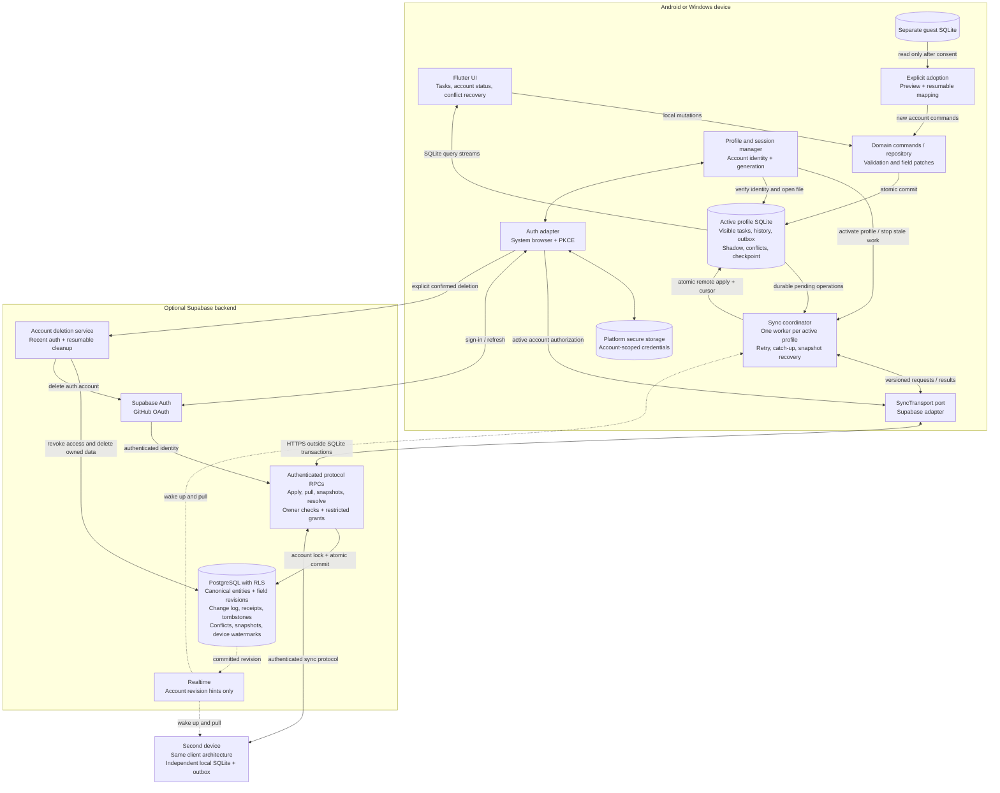

# Phase 3 architecture: optional accounts and sync

Status: planned architecture, 9 October 2026. Accounts, transport and backend
components below are not implemented. The existing guest app supplies the
SQLite command/query foundation. See the [delivery plan](../proposals/2026-10-09-phase-3-plan.md)
for milestones and [verification tracker](../verification/phase-3.md) for evidence.

## Component overview

The expanded client represents either Android or Windows. Each device has its
own SQLite files, outbox, credentials and worker. Both devices synchronize
through the account backend; they do not write directly to one another.



Solid arrows carry commands, data or lifecycle control. Dotted arrows are
notification hints; they never replace the durable change log. The diagram
expands an account-active session. Guest mode uses the same local command/query
path against the guest file, with transport disabled. Other accounts have
separate inactive files, omitted here for readability.

## One edit travelling between devices

The UI reports Saved after the first local commit. Server acknowledgement and
download progress are separate; pending operations prevent a Synced claim.

```mermaid
sequenceDiagram
  autonumber
  participant UA as Device A UI
  participant LA as Device A SQLite
  participant WA as Device A worker
  participant S as Backend RPC / PostgreSQL
  participant WB as Device B worker
  participant LB as Device B SQLite
  participant UB as Device B UI

  UA->>LA: Validated command through repository
  Note over LA: One transaction: entity + history<br/>outbox sequence + reminder-dirty intent
  LA-->>UA: Committed query update: Saved
  LA-->>WA: Pending operation available
  WA->>S: Apply immutable operation with original bases
  Note over S: Lock account row; validate identity and sequence<br/>Commit fields, conflicts, revision, log and receipt together
  S-->>WA: Durable result / acknowledgement
  WA->>LA: Commit result and pending-state update
  S-->>WB: Optional realtime revision hint
  Note over WB: Also catch up on launch, resume and reconnect<br/>Foreground polling covers missed hints
  WB->>S: Pull complete revision groups after cursor
  S-->>WB: Committed changes and cursor
  WB->>LB: Apply shadow, replay pending edits, advance cursor
  Note over LB: One local transaction; original edit bases retained
  LB-->>UB: SQLite query stream updates visible tasks
```

A lost server response leaves the same operation retryable. Receipts and durable
device sequence watermarks prevent applying it twice. A same-field conflict
retains base/local/server alternatives for recovery; unrelated fields can merge.
Deletion dominates visibility without silently discarding concurrent edits.
Conflict resolution follows the same local command/outbox path and checks the
current field versions again.

## Boundaries that the diagrams preserve

- **Local durability:** network calls never occur inside SQLite transactions.
  Backend/auth failure cannot prevent an already-open profile from local editing.
- **Account isolation:** file metadata, credentials, workers and callbacks are
  scoped to the account. Profile generations reject responses from an old session.
  Signing out retains pending work by default; reopening requires authentication.
- **Guest consent:** adoption copies through stable mappings and new authorized
  commands. Guest history is not uploaded as an account queue. Destination writes
  are atomic, while the manifest handles recovery across the two files.
- **Download recovery:** snapshots use durable staging and checkpoints. Installing
  accepted state preserves pending local edits and their original causal bases.
  Expired cursors or server-epoch changes trigger recovery rather than overwrite.
- **Server authorization:** RPCs derive ownership from authentication; RLS and
  restricted grants prevent cross-account reads and protocol-bypassing writes.
  Privileged deletion credentials stay server-side.
- **Phase boundary:** reminder-dirty intent stays durable, but OS scheduling,
  recurrence and calendar UI remain Phase 4. Dependency sequencing and precise
  wire/schema changes still need the plan's 3.0 contract fixtures.

The [accepted design](../proposals/2026-10-03-offline-first-architecture.md)
sections 5, 8 and 9 define the full policies. These diagrams describe intended
behavior; they do not establish runtime support or close any acceptance gate.
